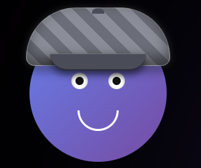

# Cue

I built Cue to decouple my AI agents from the terminal. It's a lightweight, transparent desktop UI that acts as a visual "puppet" for whatever LLM I'm using locally (like Claude, Aider, or Cursor). 

Cue doesn't hold any API keys or manage conversation history. It just sits on my screen, runs a local HTTP server, and updates its face and UI based on the JSON payloads it receives.



## Features
* **Transparent & Draggable:** Borderless WPF window that sits over your workspace. Click the face to drag it around.
* **Animated States:** Smooth CSS transitions for `idle`, `thinking`, `speaking`, `alert`, and `celebrating`.
* **Mouse Tracking:** Eyes follow your cursor when in the idle state.
* **Rich HTML Injection:** Pass raw, inline-styled HTML in the payload to render charts, data tables, or error logs right next to the face.

## How it Works
The frontend is built with standard HTML/CSS/JS running inside a Microsoft `WebView2` control. The backend is a C# app that manages window transparency and runs an `HttpListener` on a background thread to catch incoming POST requests.

## Usage / API
To control Cue, just send a POST request to `http://127.0.0.1:8081/update`.

**Payload Schema:**
```json
{
  "emotion_state": "speaking", 
  "dialogue": "Hey, the data pipeline finished.",
  "html_payload": "<div style='color:green'>Rows processed: 1.2M</div>"
}
```
*(Valid emotion states: `idle`, `thinking`, `speaking`, `alert`, `celebrating`. Set `html_payload` to `null` to hide the panel).*

## Hooking it up to an LLM
The LLM itself **never** talks to the URL directly. It just outputs a tool call based on a schema you provide. Your local client (Aider, an MCP server, a custom Python script, etc.) catches that tool call and physically sends the HTTP request.

### 1. The Tool Schema (What you give the LLM)
This tells the LLM that the tool exists and what arguments it accepts.
```json
{
  "name": "update_cue_face",
  "description": "Updates the desktop visual assistant with a new expression, speech bubble, and optional HTML data.",
  "parameters": {
    "type": "object",
    "properties": {
      "emotion_state": { "type": "string" },
      "dialogue": { "type": "string" },
      "html_payload": { "type": "string" }
    }
  }
}
```

### 2. The Glue Code (What your client runs)
Here is an example of the middleman logic (in Python) that catches the LLM's requested tool call and actually pings Cue's local server:

```python
import requests

def execute_tool_call(tool_name, arguments):
    if tool_name == "update_cue_face":
        # THIS is where the URL lives. The LLM never sees this.
        url = "[http://127.0.0.1:8081/update](http://127.0.0.1:8081/update)"
        
        try:
            # Your client physically sends the HTTP request to Cue
            requests.post(url, json=arguments)
            return "Success: Cue has been updated."
        except Exception as e:
            return f"Error connecting to Cue: {str(e)}"
```

---
**Tech Stack:** C# | WPF | WebView2 | JavaScript | CSS